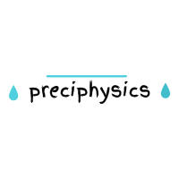

## &infin; preciphysics &infin;

- Preciphysics is a Python library offering a bunch of meteological and numerical calculations.
- Apart from numerical calculations it offers some visualization plots such as meteogram, skew-T etc.
- This Python package is under development with an attempt to be taken onto further supportment.

> Experimental work by an Undergraduate Student dedicated to the improvement of the meteorological implications and numerical modelling studies in Turkey.



***by Berkay & Kutay DÖNMEZ***
------------

 ## calcsy.py &radic;
- Calcsy offers a bunch of meteorological calculations. Fundamentally used equations in Thermodynamics and Precipitation physics are gathered in simply defined functions. 
- Each equation function can take arrays of parameters.
- Calcsy is still in development.
### Some Examples &times;
1. Using calcsy to calculate sensible heat in Joule(J) given the initial and final temperature in Celcius(&deg;C) and Mass of air in (kg) with the help of sens_heat() function.

Input :
    
```python
sense_heat(tmpi=20, tmpf=21, M=0.5)
# tmpi = Initial Temperature (C)
# tmpf = Final Temperature (C)
# M    = Mass (kg)
```
Output : 


```python
502.5
#Returns sensible heat in Joules in an array form.
```

------------


## meteogravis.py &radic;
- Meteogravis offers you to plot your own meteogram easily. There are 2 different functions in which the former plots the Temperature and MSLP meteogram while the latter plots the Visibility and the Precipitation Accumulation.
- It expects from you to enter individually preferred 4 parameters which are ;

	1. Latitude
  
	*`Latitude on which the plotting will be performed`*
	
	2. Longitude
  
	*`Longitude on which the plotting will be performed`*
	
	3. Days
  
	*`Count of days that will be plotted`* - Time related
	
	4. GFS Dataset 
  
	*`Meteogravis only accept GFS Dataset now but future improvements on the way in which other Datasets will also be accepted.`*


------------

| preciphysics  | *Function Counts in use*  |
| ------------ | ------------ |
| *Calcsy*  | 9 Functions in use |
| *Meteogravis*  | 2 Functions in use |


